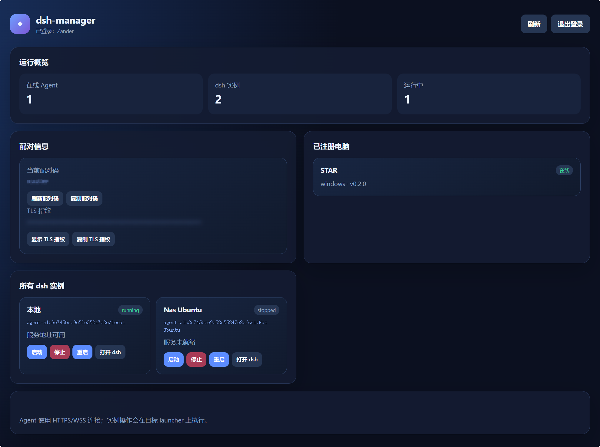

# dsh-manager




服务器端 dsh 实例管理服务，使用 Go 编写，可直接运行或通过 Docker 部署。Docker 镜像发布到 `nevermindzzt/dsh-manager`。

配套 Windows Agent / launcher：[github.com/NevermindZZT/dsh-launcher](https://github.com/NevermindZZT/dsh-launcher)

## 当前功能

- 独立 Go 工程与 Git 仓库；
- SQLite Agent / instance registry；
- 一次性 Agent 配对码；
- Agent Token 使用 Windows DPAPI 加密保存在 launcher；
- 自动生成自签名 TLS 证书；
- Agent HTTPS / WSS 长连接；
- Agent 注册、心跳和多实例状态同步；
- 管理员查询 Agent 与 dsh 实例；
- 管理员通过 WebSocket 下发启动、停止、重启、同步和更新命令；
- 按浏览器会话选择实例的 dsh HTTP 代理；
- 移动端友好的内置 Dashboard；
- Docker / docker-compose 部署；
- HTTP 与 HTTPS 服务优雅退出。

## 快速运行

需要 Go 1.26+。默认读取当前目录的 `config.yaml`，环境变量优先级高于配置文件：

```powershell
$env:DSH_MANAGER_HTTP_ADDR = ":8080"
$env:DSH_MANAGER_AGENT_HTTPS_ADDR = ":8443"
$env:DSH_MANAGER_DATA_DIR = "./data"
$env:DSH_MANAGER_PAIRING_CODE = "paste-a-one-time-code"
$env:DSH_MANAGER_ADMIN_USERNAME = "admin"
$env:DSH_MANAGER_ADMIN_PASSWORD = "change-this-password"
$env:DSH_MANAGER_ADMIN_TOKEN = "keep-this-private"
go run ./cmd/dsh-manager
```

也可以复制配置模板：

```powershell
Copy-Item .\config.example.yaml .\config.yaml
# 编辑 config.yaml 后直接启动
.\bin\dsh-manager.exe
```

manager 启动时会在数据目录生成：

```text
server.crt
server.key
```

日志会打印服务器证书 SHA-256 指纹。launcher 设置中必须填写该指纹，不能在公网环境无条件信任自签名证书。

Dashboard 登录使用 DSH_MANAGER_ADMIN_USERNAME 和 DSH_MANAGER_ADMIN_PASSWORD。未设置密码时，manager 会生成随机密码并打印到启动日志。正式部署应通过环境变量或 Secret 注入，不要把密码、Token 或配对码提交到 Git。

Dashboard 可以访问 http://服务器:8080/ 或 https://服务器:8443/。HTTP 模式适合可信内网；公网或不可信网络应使用 HTTPS/WSS。

## Docker

```powershell
$env:DSH_MANAGER_PAIRING_CODE = "one-time-pairing-code"
$env:DSH_MANAGER_ADMIN_USERNAME = "admin"
$env:DSH_MANAGER_ADMIN_PASSWORD = "change-this-password"
$env:DSH_MANAGER_ADMIN_TOKEN = "long-random-admin-token"
docker compose pull
docker compose up -d
```

也可以直接拉取 Docker Hub 镜像：

```powershell
docker pull nevermindzzt/dsh-manager:latest
docker run -d --name dsh-manager `
  -p 8080:8080 -p 8443:8443 `
  -v ${PWD}/data:/data `
  -e DSH_MANAGER_HTTP_ADDR=:8080 `
  -e DSH_MANAGER_AGENT_HTTPS_ADDR=:8443 `
  -e DSH_MANAGER_ADMIN_USERNAME=admin `
  -e DSH_MANAGER_ADMIN_PASSWORD=change-this-password `
  -e DSH_MANAGER_PAIRING_CODE=change-this-pairing-code `
  -e DSH_MANAGER_ADMIN_TOKEN=change-this-api-token `
  nevermindzzt/dsh-manager:latest
```

发布工作流需要在 GitHub 仓库 Secrets 中配置：

```text
DOCKERHUB_USERNAME
DOCKERHUB_TOKEN
```

推送版本标签（例如 v0.2.0）后，GitHub Actions 会构建 linux/amd64 和 linux/arm64 镜像并推送到 Docker Hub。

端口：

```text
8080  管理 API / Dashboard HTTP
8443  Agent HTTPS / WSS 通道
```

正式公网部署应在 8080/8443 前配置反向代理和正式 HTTPS 证书。当前自签名证书主要用于没有公共证书的内网或自托管环境；launcher 通过证书指纹固定验证 manager。

## 登录 API

Dashboard 使用用户名密码登录，成功后返回 HttpOnly Session Cookie：

```http
POST /api/v1/auth/login
Content-Type: application/json

{"username":"admin","password":"..."}
```

旧版 Admin Token 仍可用于自动化 API，Dashboard 不再要求手动输入 Token。

## API

健康检查：

```http
GET /healthz
```

Agent 配对和心跳支持 HTTP 或 HTTPS；公网推荐 HTTPS：

```http
POST https://manager.example.com:8443/api/v1/agents/enroll
Content-Type: application/json

{"pairingCode":"...","name":"Office-PC","platform":"windows","launcherVersion":"0.2.2"}
```

响应中的 `agentToken` 只返回一次。launcher 会使用 Windows DPAPI 保护后保存。

Agent WebSocket：

```text
wss://manager.example.com:8443/api/v1/agent/connect
Authorization: Bearer <agentToken>
X-Agent-Id: <agentId>
```

Agent 消息类型：

```text
register
heartbeat
command_result
```

实例状态示例：

```json
{
  "type": "heartbeat",
  "instances": [
    {
      "instanceId": "local",
      "displayName": "本地",
      "type": "local",
      "state": "running",
      "urlAvailable": true,
      "generation": 1,
      "eventSeq": 3
    }
  ]
}
```

管理员查询：

```http
GET /api/v1/agents
GET /api/v1/instances
Authorization: Bearer <adminToken>
```

管理员下发命令：

```http
POST /api/v1/instances/{agentId}/{instanceId}/commands
Authorization: Bearer <adminToken>
Content-Type: application/json

{"action":"restart"}
```

支持的命令：

```text
start
stop
restart
sync
update
```

## dsh UI 代理

管理员在 Dashboard 中点击「打开 dsh」后，manager 返回唯一的实例 URL：

```text
/dsh/<session-id>/
```

浏览器地址栏保持该路径，不再直接使用根路径。dsh 发出的绝对路径请求仍通过实例 Cookie 路由到同一个目标实例。代理覆盖 GET、POST、PUT、PATCH、DELETE、OPTIONS 等 HTTP 方法，以及 HTML、静态资源、REST API、上传下载和 dsh 实时 WebSocket 会话。WebSocket 使用文本/二进制帧转发，并在浏览器、manager、Agent、目标 dsh 之间保持独立的关闭和超时语义。

## dsh plugin Agent

除 dsh-launcher 外，manager 还支持在 dsh 进程内运行的直连插件：

```text
浏览器 -> dsh-manager -> dsh-manager-plugin -> 当前 dsh
```

插件使用同一套 Agent Protocol v1，只增加可选的 agentType、agentVersion、pluginVersion 和 capabilities 字段，不改变旧 launcher 的连接方式。

推荐能力：

- `proxy.http`
- `proxy.websocket`
- `settings.host`
- `plugin.config`

插件仓库和安装说明：
https://github.com/NevermindZZT/dsh-manager-plugin

插件不能执行 start/stop/restart/update 等 launcher 生命周期命令；dsh 退出后插件连接也会断开。launcher Agent 与 plugin Agent 可以同时连接到同一个 manager。

## 安全边界

- Agent Token 只在配对响应中返回一次；
- Agent 连接支持 HTTP/WS 和 HTTPS/WSS；
- HTTPS 模式下 launcher 必须配置 manager 证书指纹；
- manager 不保存 SSH 私钥、SSH 密码或 dsh credentials；
- manager 不提供任意 shell 执行接口；
- Dashboard 使用 bcrypt 密码哈希和 HttpOnly Session Cookie；
- 静态 Admin Token 仅作为自动化 API 兼容方式；
- 用户登录、细粒度 RBAC 和审计界面属于后续版本；
- 不要把当前 HTTP Dashboard 端口直接暴露到不可信公网。
